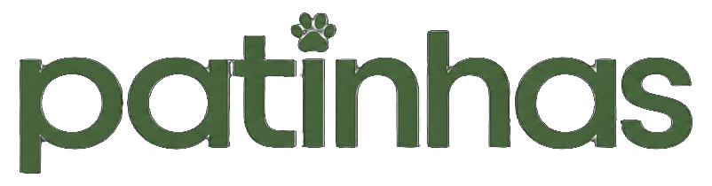

<div align="center">



# Patinhas Brasil 🐾

**Adoção de pets, transparente e em tempo real.**

Um mural público estilo Kanban que mostra cada bichinho na sua etapa —
_disponível → em processo → adotado_ — e dá a abrigos e ONGs um painel
simples para gerenciar tudo.

[🌐 patinhasbrasil.com.br](https://patinhasbrasil.com.br) ·
[📊 Observatório](https://patinhasbrasil.com.br/observatorio/) ·
[🏠 Área do abrigo](https://patinhasbrasil.com.br/admin.html)


</div>

---

## Por que existe

Adotar deveria ser tão fácil quanto acompanhar um pedido de delivery. O Patinhas
transforma o processo de adoção — hoje espalhado em stories, grupos de WhatsApp e
planilhas — em um mural claro, público e atualizado em tempo real. Quem quer adotar
vê exatamente quais pets estão disponíveis; quem resgata gerencia tudo em um só lugar.

## O que faz

- 🗂️ **Mural Kanban** — pets organizados em _Disponível · Em processo · Adotado_, com drag-and-drop no painel do abrigo.
- 🔎 **Filtros inteligentes** — espécie, porte, saúde (vacinado/vermifugado/castrado), estado e ONG, com URL compartilhável.
- 💌 **Central de Interessados** — cada "Quero adotar!" vira um contato organizado por etapa de triagem para o abrigo.
- 🏥 **Painel do abrigo** — cadastro individual ou em lote, edição, e alerta de anúncios desatualizados.
- 📊 **Observatório** — dados públicos sobre adoção no Brasil.
- 🔐 **Login com Google** (OAuth via Supabase) para os abrigos.
- 📈 **Analytics próprio** de visitas, respeitando privacidade.

## Stack

Feito para ser **leve, barato e sem manutenção de infra**:

| Camada | Tecnologia |
|---|---|
| Frontend | HTML + CSS + JavaScript **vanilla** — sem framework, **sem build** |
| Backend | [Supabase](https://supabase.com) (Postgres, Auth, Storage) |
| Hospedagem | [Vercel](https://vercel.com) com deploy contínuo |
| DNS / domínio | Hostinger → Vercel, HTTPS automático |

> Sem `node_modules`, sem passo de build, sem servidor para manter. O site é um
> punhado de arquivos estáticos que qualquer navegador abre.

## Rodando localmente

```bash
git clone https://github.com/mrcx-code/patinhas.git
cd patinhas
python -m http.server 8000
```

Acesse **http://localhost:8000**.

- **Modo demonstração:** sem configurar nada, o site sobe com dados de exemplo (`js/mockData.js`) — nada é salvo. Ótimo para ver o visual.
- **Modo real:** com as chaves do Supabase em `js/config.js`, o site usa o banco de verdade.

> ⚠️ As chaves versionadas em `js/config.js` apontam para o **banco de produção**.
> Escritas feitas localmente afetam dados reais — para experimentar à vontade,
> use um projeto Supabase separado de staging.

## Estrutura

```
index.html                → mural público (Kanban)
sobre.html                → institucional + métricas de impacto
admin.html                → login e painel do abrigo/ONG
admin-interessados.html   → Central de Interessados
observatorio/             → Observatório (dados públicos, design isolado)
css/                      → style.css (design system) + observatorio.css
js/
  ├─ config.js            → chaves do Supabase
  ├─ supabaseClient.js    → conexão (ou fallback para o modo demo)
  ├─ app.js               → lógica do mural público
  ├─ admin.js             → painel do abrigo
  ├─ admin-interessados.js→ Central de Interessados
  ├─ sobre.js / observatorio.js
  ├─ analytics.js         → registro de visitas
  ├─ utils.js             → helpers + auth compartilhada
  └─ mockData.js          → dados do modo demonstração
sql/schema.sql            → schema das tabelas no Supabase
```

## Deploy

Todo push para `main` que altere os arquivos do site dispara um deploy automático
na Vercel (~1 min). Sem etapas manuais.

## Roadmap

- [ ] Notificação por e-mail para o abrigo a cada novo interessado
- [ ] Múltiplas fotos por pet
- [ ] Ambiente de staging isolado do banco de produção
- [ ] Página individual por pet (SEO + compartilhamento)

---

<div align="center">
<sub>Feito com 🐾 para diminuir a distância entre um pet e um lar.</sub>
</div>
